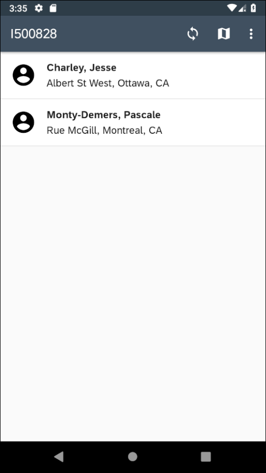
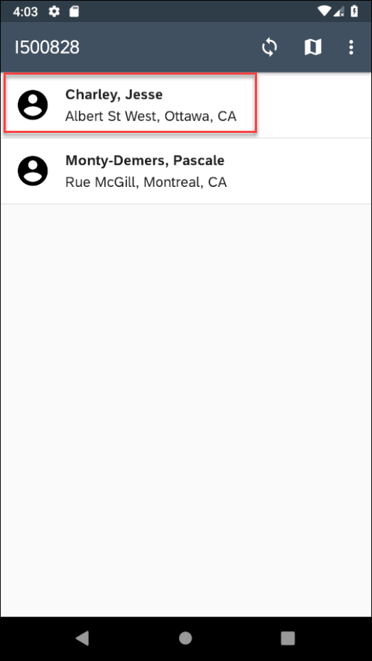
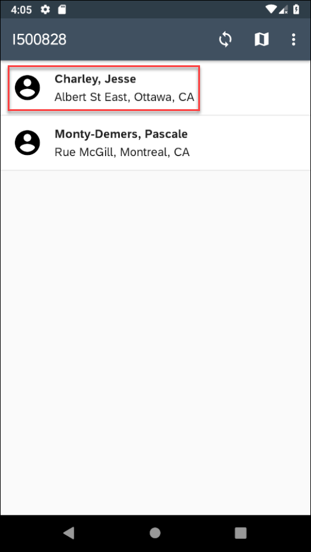
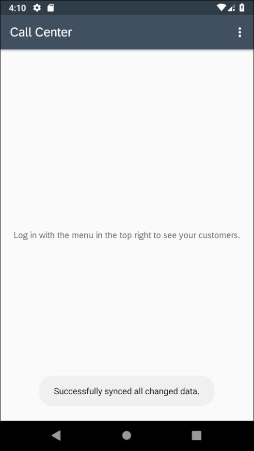

# SAP Cloud Platform SDK for Android Multi-User Sample Documentation

## Table of Contents
- [User Registration](#user-registration)
- [Saving and Retrieving the Current User Settings](#saving-and-retrieving-the-current-user-settings)
- [Setting Up Current User and Shared Offline Stores](#setting-up-current-user-and-shared-offline-stores)
- [Updating the Current User Offline Store](#updating-the-current-user-offline-store)
- [Data Synchronization](#data-synchronization)

See also [README.md](readme.md)


## User Registration
The user authentication of the app is handled using OAuth, which allows the user to input their credentials. The `WebViewProcessor` displays the authentication UI from the SAP Identity Provider if authentication is required.

The following code snippet shows the relevant authentication code.

```Java
deviceID = android.provider.Settings.Secure.getString(this.getContentResolver(), android.provider.Settings.Secure.ANDROID_ID);

OAuth2Configuration oAuth2Configuration = new OAuth2Configuration.Builder(getApplicationContext())
        .clientId(OAUTH_CLIENT_ID)
        .responseType("code")
        .authUrl(AUTH_END_POINT)
        .tokenUrl(TOKEN_END_POINT)
        .redirectUrl(OAUTH_REDIRECT_URL)
        .build();

SAPOAuthTokenStore oauthTokenStore = SAPOAuthTokenStore.getInstance();
try {
    settingsParameters = new SettingsParameters(serviceURL, appID, deviceID, "1.0");
} catch (MalformedURLException e) {
    Log.d(myTag, "Error creating the settings parameters: " + e.getMessage());
}
OkHttpClient myOkHttpClient = new OkHttpClient.Builder()
        .addInterceptor(new AppHeadersInterceptor(appID, deviceID, "1.0"))
        .addInterceptor(new OAuth2Interceptor(new OAuth2WebViewProcessor(oAuth2Configuration), oauthTokenStore))
        .cookieJar(new WebkitCookieJar())
        .build();

ClientProvider.set(myOkHttpClient);
```


The following code shows the required `Request` used to log out of the app. The implementation can be seen in the `unRegisterLogic` method of the sample app's `MainActivity.java`.

```Java
Request request = new Request.Builder()
        .post(RequestBody.create(null, ""))
        .url(serviceURL + "/mobileservices/sessions/logout")
        .build();

Callback updateUICallback = new Callback() {
    @Override
    public void onFailure(@NonNull Call call, final IOException e) {
        ...
    }

    @Override
    public void onResponse(@NonNull Call call, final Response response) {
        if (response.isSuccessful()) {
            ...
        }
        else {
            ...
        }
    }
};
ClientProvider.get().newCall(request).enqueue(updateUICallback);
```

For more information on the inner workings of OAuth, see [OAuth 2.0 Reference](https://help.sap.com/doc/c2d571df73104f72b9f1b73e06c5609a/Latest/en-US/docs/user-guide/foundation/authentication.html#oauth-20).

## Saving and Retrieving the Current User Settings
When a user first logs in, they are asked to choose the country they are going to work from. This choice is then saved to the backend server using the [Storage Service](https://help.sap.com/doc/c2d571df73104f72b9f1b73e06c5609a/Latest/en-US/docs/user-guide/foundation/settings.html).


In order to view the data changes made to the storage service, the project in  the `SAP Cloud Platform Mobile Services` must have the `JSON Storage` feature enabled. In case the project does not have it enabled, go to the project's home page, click the `+` button and add the `JSON Storage` feature.


An example of a JSON object that could be stored on the server is given below:

```JSON
{
    "mobileservices": {
        "settingsExchange": {
            "passwordPolicy": {
                "passwordPolicyMinLength": "8",
                "passwordPolicyLowerRequired": "false",
                "passwordPolicyDefaultPasswordAllowed": "false",
                "passwordPolicyRetryLimit": "10",
                "passwordPolicyUpperRequired": "false",
                "passwordPolicyEnabled": "false",
                "passwordPolicySpecialRequired": "false",
                "passwordPolicyExpiresInNDays": "0",
                "passwordPolicyLockTimeout": "300",
                "passwordPolicyDigitRequired": "false",
                "passwordPolicyMinUniqueChars": "0"
            },
            "featureVectorPolicies": {
                "featureVectorPolicyAllEnabled": "true",
                "restrictedPolicies": null
            },
            "logSettings": {
                "logEntryExpiry": "7",
                "logLevel": "NONE"
            }
        }
    },      
    "customAppDefinedConfigs1": {
        "appConfig1": "value1",
        "appConfig2": "value2"
    }
}
```

The storage service has three target levels at which data can be stored:
- Application
- User
- Device

The code below stores the user's country in the `User` level, which allows the data to be accessible only by users it belongs to. For instance, the below user's country is set to CA, thus only Canadian customers are shown.



The following code snippet shows how the country is mapped to the user's ID under a custom node called `countrySelection`, which is sent to the storage service:

```Java
private void storeCountry(String countryCode) {
    // Create JSON mapping user to country
    JSONObject jsonVal;
    try {
        jsonVal = new JSONObject("{'" + currentUser + "':'" + countryCode + "'}");
    } catch (JSONException e) {
        e.printStackTrace();
        Log.e(myTag, "Error while creating JSON: " + e.getMessage());
        return;
    }
    // Send JSON map to be made under countrySelection node
    settings.store(Settings.SettingTarget.USER, "countrySelection", jsonVal, new Settings.CallbackListener() {
        @Override
        public void onSuccess(@NonNull JSONObject obj) {
            try {
                Integer responseCode = obj.getInt("code");
                String responseMessage = obj.getString("message");
                Log.d(myTag, responseMessage + ", code: " + responseCode);
            } catch (JSONException je) {
                Log.e(myTag, "Error occurred getting values from JSON: " + je.getMessage());
            }
        }

        @Override
        public void onError(@NonNull Throwable result) {
            if (result instanceof HttpException) {
                HttpException ne = (HttpException) result;
                Log.e(myTag, ne.message() + ", with Error code: " + ne.code());
            } else {
                Log.e(myTag, "Error occurred updating the storage service: " + result.getMessage());
            }
        }
    });
}
```

If the user had previously logged in and chosen a country, the app will retrieve their country from the storage service instead of making them choose again. This can be easily done since the user's country will be in the `countrySelection` JSON object if it has been set. This information can be seen in the `JSON Storage` feature.


A request is made to the storage service looking for the current user's ID inside the `countrySelection` JSON object. If the key is not found and the request returns a 404 error, then the user is prompted to select a country.

The following function shows how the country is retrieved from the storage service:

```Java
private void getCountryCode() {
    settings.load(Settings.SettingTarget.USER, "countrySelection", new Settings.CallbackListener() {
        @Override
        // User was previously assigned a country
        public void onSuccess(@NonNull JSONObject jsonObject) {
            try {
                String countryFromStorageService = jsonObject.getString(currentUser);
                Log.d(myTag, "Retrieved the country code from the storage service: " + countryFromStorageService);
                countryCode = countryFromStorageService;
                setUpCurrentUserDatabase();
            } catch (JSONException e) {
                e.printStackTrace();
                Log.d(myTag, "Error while parsing JSON for country code: " + e.getMessage());
            }
        }

        @Override
        // Could not find country assigned to user
        public void onError(@NonNull Throwable result) {
            if (result instanceof HttpException) {
                HttpException httpException = (HttpException) result;
                if (httpException.code() == 404) {
                    Log.d(myTag, "Country code not set in the JSON Storage, user must choose a country.");
                    selectCustomerRegion();
                } else {
                    Log.e(myTag, httpException.message() + ", with Error code: " + httpException.code());
                }
            } else {
                Log.e(myTag, "Error while getting country code from storage service: " + result.getMessage());
            }
        }
    });
}
```

Instead of using the JSON Storage, the country could be derived from the user's offline store, such as retrieving their customers' country.

For more information see [Storage Service](https://help.sap.com/doc/c2d571df73104f72b9f1b73e06c5609a/Latest/en-US/docs/user-guide/foundation/settings.html).

## Setting Up Current User and Shared Offline Stores
The user's offline store can be set up with the appropriate customers now that their country is known. This can be done by adding a defining query to the `OfflineODataProvider` before it is opened to specify a filter on the customers.

See [Setting Up an Application](https://help.sap.com/doc/c2d571df73104f72b9f1b73e06c5609a/Latest/en-US/docs/user-guide/odata/Offline_OData_Setting_Up_Application.html) and [Defining an Application Configuration File](https://help.sap.com/doc/c2d571df73104f72b9f1b73e06c5609a/1.0/en-US/docs/user-guide/odata/Defining_an_Application_Configuration_File_with_Defining_Request/index.html) for more information about defining queries and setting up the offline store.

The following code snippet shows how the offline store is created with the selected country:

```Java
private void setUpCurrentUserDatabase() {
    try {
        URL url = new URL(serviceURL + "/" + connectionID);
        OfflineODataParameters offParam = new OfflineODataParameters();
        offParam.setEnableRepeatableRequests(false);
        offParam.setStoreName(currentUser);

        // Reset store
        if (storageManager.getCurrentUserOfflineODataProvider() != null) {
            storageManager.getCurrentUserOfflineODataProvider().close();
//          storageManager.getCurrentUserOfflineODataProvider().clear();
//          storageManager.setCurrentUserOfflineODataProvider(null);
        }

        // Filter customers on country
        storageManager.setCurrentUserOfflineODataProvider(new OfflineODataProvider(url, offParam, ClientProvider.get(), null, null));
        String query = "Customers?$filter=Country eq '" + countryCode + "'";
        Log.d(myTag, "The defining query is: " + query);
        OfflineODataDefiningQuery definingQuery = new OfflineODataDefiningQuery("CustomersInRegion", query, false);
        storageManager.getCurrentUserOfflineODataProvider().addDefiningQuery(definingQuery);
    } catch (Exception e) {
        e.printStackTrace();
        Log.d(myTag, "Exception encountered setting up current user store: " + e.getMessage());
    }

    Log.d(myTag, "Current user offline store is now: " + storageManager.getCurrentUserOfflineODataProvider().getServiceName());

    // Retrieve and display customers to the user
    runOnUiThread(() -> {
        ((TextView) findViewById(R.id.description)).setText("Opening " + currentUser + "'s Offline Store");
    });
    storageManager.getCurrentUserOfflineODataProvider().open(() -> {
//      Log.d(myTag, "Current user offline store is open");
//      toastAMessageFromBackground("Current user offline store opened");
//      storageManager.setCurrentUserESPMContainer(new ESPMContainer(storageManager.getCurrentUserOfflineODataProvider()));
//      runOnUiThread(() -> {
//          unRegisterMenuItem.setEnabled(true);
//          logSharedDataMenuItem.setEnabled(true);
//          changeCountryMenuItem.setEnabled(true);
//          initCustomerList();
//      });

        runOnUiThread(() -> {
            ((TextView) findViewById(R.id.description)).setText("Downloading latest changes to " + currentUser + "'s Offline Store");
        });
        storageManager.getCurrentUserOfflineODataProvider().download(() -> {
            storageManager.setCurrentUserESPMContainer(new ESPMContainer(storageManager.getCurrentUserOfflineODataProvider()));
            runOnUiThread(() -> {
                logSharedDataMenuItem.setEnabled(true);
                changeCountryMenuItem.setEnabled(true);
                initCustomerList();
            });
        }, (error) -> Log.d(myTag, "Current user offline store failed to download"));
    }, (error) -> Log.d(myTag, "Current user offline store failed to open"));
}
```

Each user has their own store and multiple users can use the same device.  The current user's store name is set with `offParam.setStoreName(currentUser)`, which makes each store uniquely identifiable.

The above implementation stores all of the users' offline stores locally, which makes the initial startup time significantly faster. Every time the user logs in, the application downloads the customers that were modified since the user's last session. A problem with this design choice is that there will always be offline stores that the current user doesn't use, as they belong to other users, thus trading space for performance.

If we wanted to instead clear the offline stores every time a user logged in, remove the entire `storageManager.getCurrentUserOfflineODataProvider().download(...);` code and uncomment the commented code. The biggest difference between both design decisions is the tradeoff between space and runtime. Clearing the offline stores decrease the amount of space taken by the app while keeping the offline stores makes loading time faster.

In addition to a unique offline store for each user, the app needs to maintain a **shared** offline store that is accessible by all users. You can open such a store using the following method.

```Java
private void setupSharedStore() {
    Logger logger = (ch.qos.logback.classic.Logger) LoggerFactory.getLogger("com.sap.cloud.mobile.odata");
    logger.setLevel(Level.ALL);
    AndroidSystem.setContext(getApplicationContext());

    try {
        URL url = new URL(serviceURL + "/" + connectionID);
        OfflineODataParameters offParam = new OfflineODataParameters();
        offParam.setEnableRepeatableRequests(false);
        offParam.setStoreName("sharedStore");
        storageManager.setSharedOfflineODataProvider(new OfflineODataProvider(url, offParam, ClientProvider.get(), null, null));
        OfflineODataDefiningQuery productsQuery = new OfflineODataDefiningQuery("Products", "Products", false);
        // Customers are retrieved to find possible countries to select from
        OfflineODataDefiningQuery customersQuery = new OfflineODataDefiningQuery("Customers", "Customers", false);
        storageManager.getSharedOfflineODataProvider().addDefiningQuery(productsQuery);
        storageManager.getSharedOfflineODataProvider().addDefiningQuery(customersQuery);
    } catch (Exception e) {
        e.printStackTrace();
        Log.d(myTag, "Exception encountered setting up shared store: " + e.getMessage());
    }
    runOnUiThread(() -> {
        ((TextView) findViewById(R.id.description)).setText("Opening Shared Offline Store");
    });
    storageManager.getSharedOfflineODataProvider().open(() -> {
        Log.d(myTag, "Shared Offline Store is open");
        getCurrentUserID();
        storageManager.setSharedESPMContainer(new ESPMContainer(storageManager.getSharedOfflineODataProvider()));
        toastAMessageFromBackground("Shared Offline Store opened");
    }, (error) -> Log.d(myTag, "Shared Offline Store failed to open"));
}
```

These offline stores can be found under `Device File Explorer > data > data > com.example.android.multiuser > files`.


## Updating the Current User Offline Store

In the customer detail page of the sample application, the user can modify the customer's data which are stored locally.

The following code snippet shows the updating process in app level:

```java
public void onSave(View view) {
    if (addressChanged) {
        customer.setStreet(etAddress.getText().toString());
        adapter.notifyDataSetChanged();
        // Update the entity in the offline store
        currentUserStore.getESPMContainer().updateEntityAsync(customer, () ->
            Log.d("myDebuggingTag", "Successfully Changed Customer's Street"), (error) ->
            Log.d("myDebuggingTag", "Error getting customers: " + error.getMessage())
        );
    }
    ...
    Toast.makeText(this, "Successfully updated the customer locally.", Toast.LENGTH_LONG).show();
}
```

For more information on the implementation above, see the sample app's `ChangeCustomerDetailActivity` class.






## Data Synchronization

Since changes are made locally, they need to be uploaded to the server to be available on other devices. This data syncing is done when the user logs out, and the application will only successfully log out the user when the sync is complete.

More explanation regarding data syncing can be found at [Synchronizing Data](https://help.sap.com/doc/c2d571df73104f72b9f1b73e06c5609a/Latest/en-US/docs/user-guide/odata/Offline_OData_Synchronizing_Data.html).

The following code snippet shows the syncing process:

```Java
// First we upload the current user's offline store
storageManager.getCurrentUserOfflineODataProvider().upload(() -> {
    Log.d(myTag, "Successfully uploaded any changes made to customer data.");
    toastAMessageFromBackground("Successfully synced all changed data.");
    ...
    // Then, if the upload succeeds we log the user out
    unRegisterLogic();
}, error -> {
    // If the upload does not succeed, we do NOT log the user out
    Log.d(myTag, "Error while uploading the current user store: " + error.getMessage());
    ...
});
```



