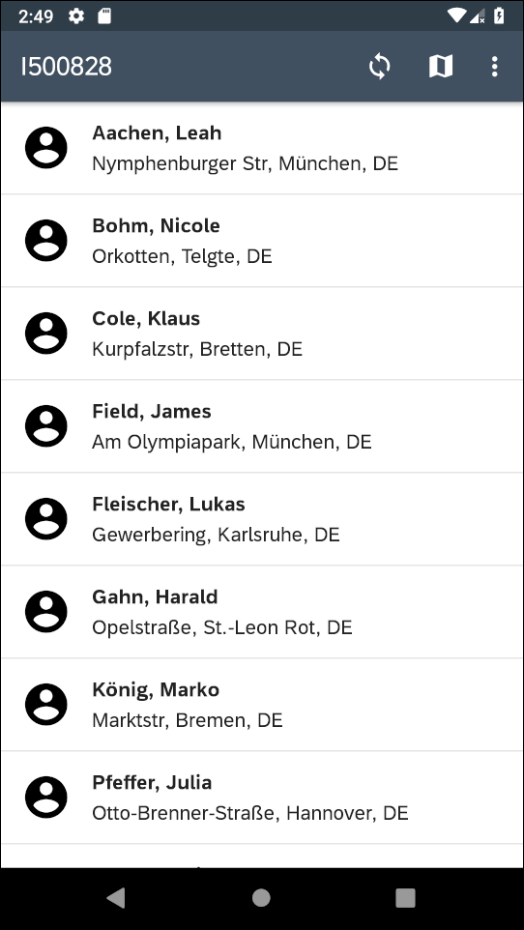
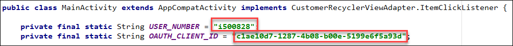

# Important Notice
This public repository is read-only and no longer maintained.

# SAP Cloud Platform SDK for Android Multi-User Sample

## Description

This application demonstrates a scenario where multiple users share a pool of devices.  The user can access and modify their data offline, where their changes are stored locally. These changes are synced to the backend when the user logs out, changes country, or use the sync button, allowing the user to use another device the next time they open the app.  The application minimizes the risks of conflicts when merging the uploaded data since users usually have different subsets of data they are responsible for.

An example use of this scenario is a call center where employees pick up a mobile device from a pool of available devices when they arrive at work each morning. Each employee is responsible for updating customer information from their assigned country, and they can only see and modify customers from their country. The sample application allows different employees to use the same device to access their assigned customer data. In other words, the application displays the appropriate information based on the current user regardless of which device they use. The next time they start a shift, they will likely have a different device, but they will have the latest data changes after a download operation occurs.

Another feature to note is that while the employees each have their own specific customer data, they can also have access to shared data (product data) that is common among all users.  This is referred to as the **shared store**.

If you are new to the SAP Cloud Platform SDK for Android, [Get Started with SAP Cloud Platform SDK for Android](https://developers.sap.com/mission.sdk-android-get-started.html), [Step by Step with the SAP Cloud Platform SDK for Android](https://blogs.sap.com/2018/10/15/step-by-step-with-the-sap-cloud-platform-sdk-for-android-part-1/) series, and the [SAP Cloud Platform SDK for Android Learning Journey](https://help.sap.com/doc/221f8f84afef43d29ad37ef2af0c4adf/HP_2.0/en-US/747d6d2ea0534ba99612920c7402631a.html) are great places to start.

## The Finished Product

The app enables customer info to be viewed and edited.

Let's start setting up this project!

## Requirements

* [Android Studio](https://developer.android.com/studio/index.html) version 3.4.0
* [SAP Cloud Platform SDK for Android from trial downloads](https://www.sap.com/developer/trials-downloads/additional-downloads/sap-cloud-platform-sdk-for-android-15508.html) or [SAP Cloud Platform SDK for Android from Software Downloads](https://launchpad.support.sap.com/#/softwarecenter/template/products/_APP=00200682500000001943&_EVENT=NEXT&HEADER=Y&FUNCTIONBAR=Y&EVENT=TREE&NE=NAVIGATE&ENR=73555000100800001281&V=MAINT&TA=ACTUAL/SAP%20CP%20SDK%20FOR%20AND) version 2.1.1
* [SAP Cloud Platform Trial](https://cloudplatform.sap.com/index.html)

The blog [Step by Step with the SAP Cloud Platform SDK for Android](https://blogs.sap.com/2018/10/15/step-by-step-with-the-sap-cloud-platform-sdk-for-android-part-1/) contains additional details on how to setup and install the SDK, how to register for a trial version of the SAP Cloud Platform, and how to enable Mobile Services.

## Setting Up Mobile Services

The initial mobile services configuration for the offline project is included in the project folder. In the mobile services cockpit, navigate to **Mobile Applications > Native/Hybrid** and click the **Import** button.

In the resulting prompt window, browse for the `mobile_services/com.sap.multiuser_1.0.zip`. Click **Save**.

The imported project configuration will have an OAuth security endpoint that does not match your user name, so next, change the OAuth endpoint in the security section of the application to your own account. To do so, remove the current OAuth configuration in the **Security** section and create another one. Leave everything blank and click **OK**.

Click **Save**, and the rest of the details for the OAuth configuration such as **Authorization Endpoint**, **Token Endpoint**, **End User UI**, and **Redirect URL** will be filled in.

## Configuration

Open the project in Android Studio.

Click update if asked to update the Android Gradle plugin.

To successfully run the application, the OAuth string constants in the application need to be changed to reflect the new values. In the project, press `Ctrl + N` on Windows, or `Command + O` on Mac, navigate to `MainActivity.java` and change the constants at the top of the file to match your username and client ID.

Your `username` and `OAUTH_CLIENT_ID` string can be found in the mobile services cockpit, as shown below.

Run the project to deploy it onto an emulator or device.  For further details on the app see [DOCUMENTATION.md](DOCUMENTATION.md).

## Known Issues

No known issues.

## How to obtain support

If you have questions/comments/suggestions regarding this app please
post them using the tag [SAP Cloud Platform SDK for Android](https://answers.sap.com/tags/73555000100800001281) or if you encounter an issue, you can [create a ticket](https://github.com/SAP/cloud-sdk-android-multiuser/issues/new).

## License

Copyright (c) 2019 SAP SE or an SAP affiliate company. All rights reserved. This project is licensed under the Apache Software License, version 2.0 except as noted otherwise in the  [LICENSE file](/LICENSES/Apache-2.0.txt).
